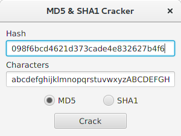

# Java Hash Cracker

## Description

The primary function is to allocate all the available RAM and convince the
Gargabe Collector to collect itself, which is a partial success. It allocates
RAM like a madman, but the GC still doesn't feel bad enough to start working
properly.  
The secondary function is to crack MD5 and SHA1 hashes, which seem to work fine.
Slowly, but fine.

## Dependencies

- Java 8 (tested on OpenJDK 1.8.0_111)
- JavaFX (tested on OpenJFX 8u60-b27-4)
